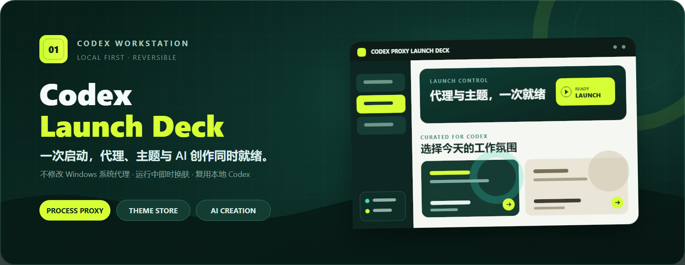
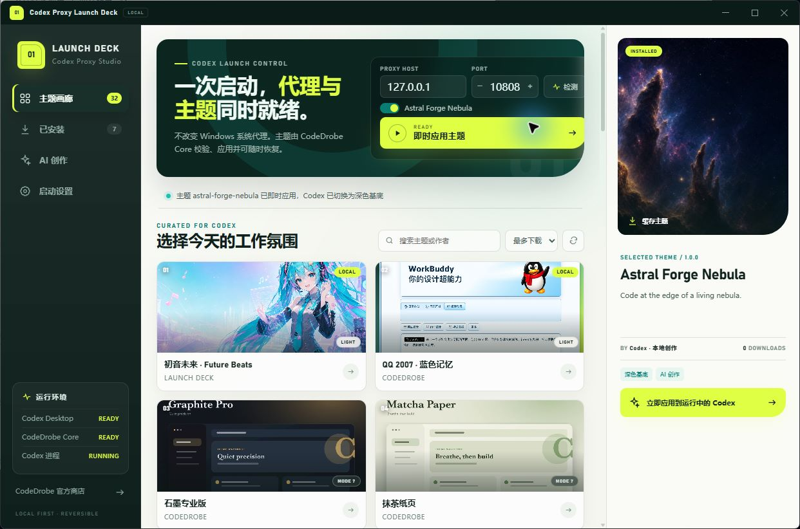
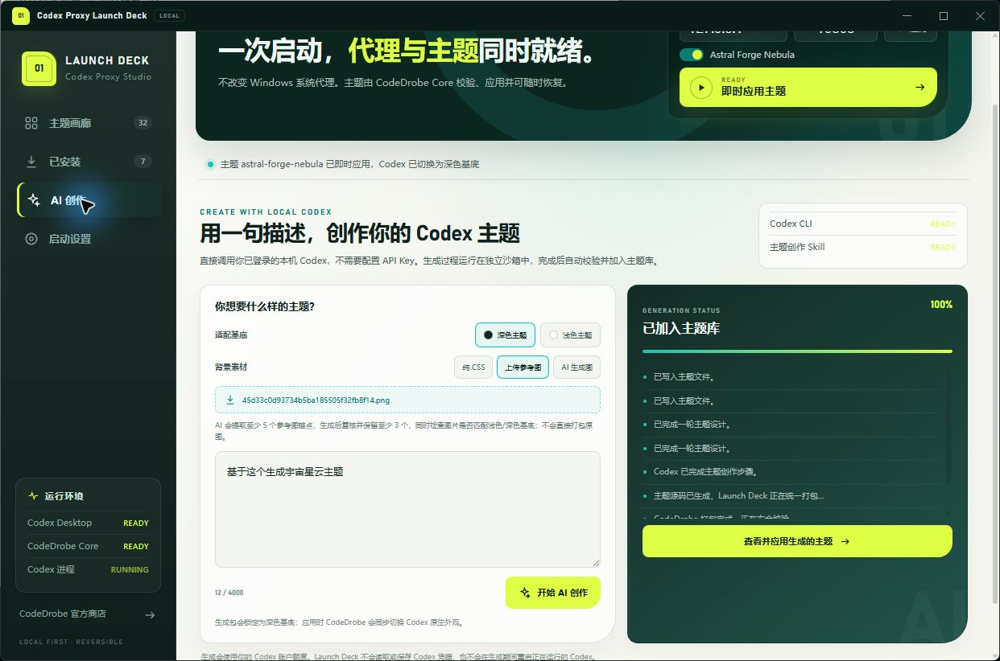
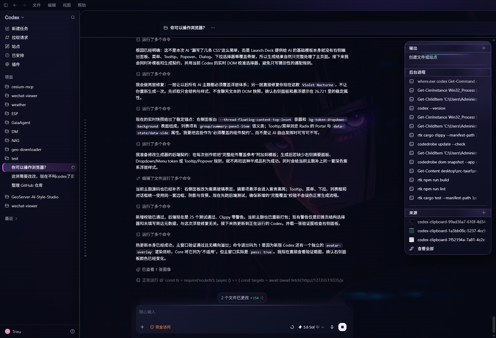

<p align="center">
  
</p>

<p align="center">
  <a href="README.md">简体中文</a> · <strong>English</strong>
</p>

<p align="center">
  <a href="https://github.com/gaopengbin/codex-launch-deck/releases/latest"></a>
  <a href="https://github.com/gaopengbin/codex-launch-deck/releases"></a>
  
  <a href="LICENSE"></a>
</p>

<p align="center">
  <strong>A Windows launch and theme workstation for Codex.</strong><br>
  Route only the launched Codex process through a proxy, browse and hot-swap CodeDrobe themes, and reuse your signed-in local Codex to create complete themes.
</p>

<p align="center">
  <a href="https://github.com/gaopengbin/codex-launch-deck/releases/latest"><strong>Download for Windows</strong></a>
  &nbsp;·&nbsp;
  <a href="https://codedrobe.app">CodeDrobe Store</a>
  &nbsp;·&nbsp;
  <a href="#quick-start">Quick start</a>
</p>

<p align="center">
  
</p>

## Three jobs, one launch deck

| Process-scoped proxy | Theme store and live switching | Local Codex-powered creation |
| --- | --- | --- |
| Passes `HTTP_PROXY`, `HTTPS_PROXY`, and `NO_PROXY` only to the Codex process tree. It never changes the Windows system proxy. | Search, install, cache, and apply CodeDrobe themes. A managed watcher restores the theme after renderer reloads. | Turn a brief or reference image into a validated `.codedrobe-theme` with your already authenticated Codex CLI. No extra API key is required. |

## Highlights

- One flow for proxy checks, Codex startup, theme validation, and application.
- Live theme switching without restarting Codex, including native light/dark appearance sync.
- Full theme coverage for the main UI, output/sources panel, tooltips, popovers, menus, lists, and dialogs.
- Marketplace search, sorting, download progress, integrity checks, local cache, and a bundled offline theme.
- CSS-only, uploaded-reference, and AI-background authoring modes.
- Accurate process and renderer detection with adaptive CDP port discovery.
- One-click restoration of native Codex appearance and watcher cleanup.

## Product views

| Create with local Codex | Apply to a running Codex window |
| --- | --- |
|  |  |

## What's new in v2.1.1

- Added a complete component-coverage contract for AI-generated themes.
- Styled right-side summary panels, tooltips, popovers, menus, lists, dialogs, and interaction states.
- Finds an executable Codex CLI instead of selecting an inaccessible Microsoft Store copy.
- Reuses the launcher's proxy configuration for AI authoring jobs.
- Waits and retries when Codex has started but its DOM is not ready for theme injection.

## Quick start

1. Enable an HTTP or mixed port in your local proxy application.
2. Install Launch Deck from the [latest GitHub Release](https://github.com/gaopengbin/codex-launch-deck/releases/latest).
3. Enter the proxy host and port, then run the connectivity check.
4. Select a theme and choose **Launch Codex**. If Codex is already running with CDP enabled, choose **Apply theme live**.

> If your proxy application exposes a SOCKS port, use its HTTP or mixed port. Launch Deck supplies an HTTP proxy URL.

## Downloads

| Asset | Use case |
| --- | --- |
| `Codex.Proxy.Launch.Deck_*_x64-setup.exe` | Recommended NSIS installer |
| `Codex.Proxy.Launch.Deck_*_x64_en-US.msi` | MSI deployment |
| `ChatGPTProxyLauncher.exe` | Legacy lightweight single-file proxy launcher |
| `ChatGPTProxyLauncher-Legacy-win-x64.zip` | Legacy launcher, bundled theme, and shortcut helper |

Public binaries are currently unsigned, so Windows SmartScreen may display a warning. Always download from this repository's Release page.

## Create a custom theme

1. Open **AI creation** in Launch Deck.
2. Enter a visual brief and choose the required light or dark Codex base.
3. Select **CSS only**, **Upload reference**, or **AI background**.
4. Follow the live generation status. Launch Deck validates the package, component coverage, artwork, and card cover before adding it to the local library.

Generated packages are stored in `%LOCALAPPDATA%\CodexProxyLaunchDeck\themes`. The CodeDrobe theme skill is required; Launch Deck detects it and can install it for the current user.

<details>
<summary><strong>Using themes with Cockpit Tools</strong></summary>

Add this to the default instance's custom launch arguments:

```text
--remote-debugging-port=9335
```

Fully exit Codex before relaunching it through Cockpit Tools. Launch Deck detects the CDP port from the process command line; choose another free port if `9335` is occupied.

</details>

## Privacy

Launch Deck does not forward or inspect network traffic. It only checks whether the configured proxy endpoint accepts a connection and passes environment variables to the new Codex process. Reference images are provided only to the explicitly started local Codex authoring job; Launch Deck does not upload them to its own service.

## Build

```powershell
cd desktop
npm ci
npm run lint
npm run build
npm run tauri build
```

```powershell
cd desktop\src-tauri
cargo test --locked
cargo clippy --locked --all-targets --all-features -- -D warnings
```

## License

[MIT](LICENSE)
